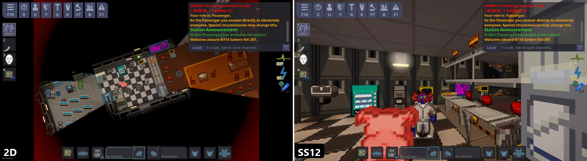
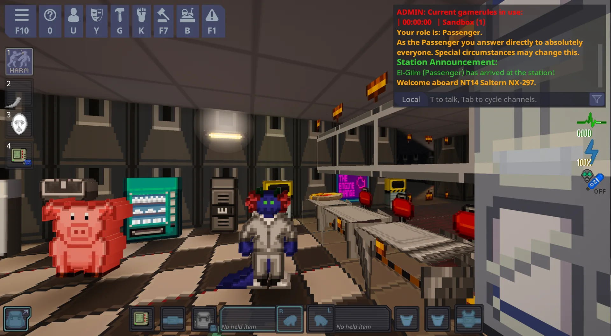
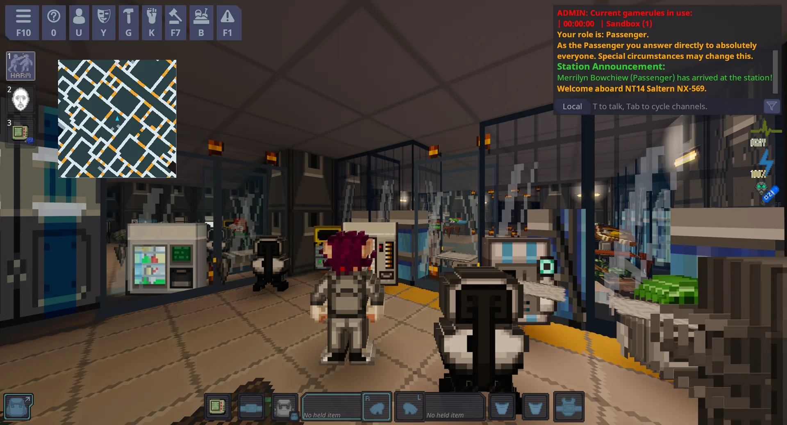
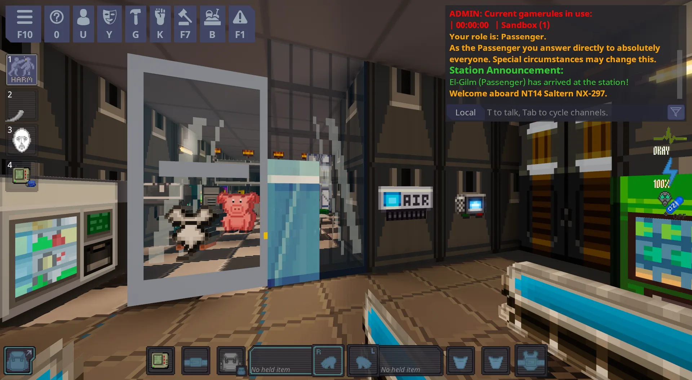
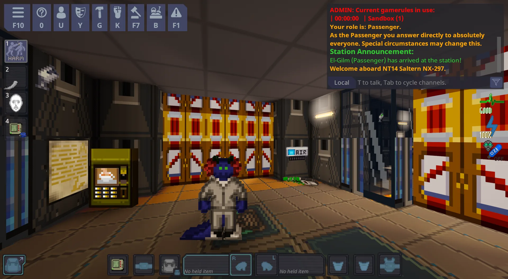
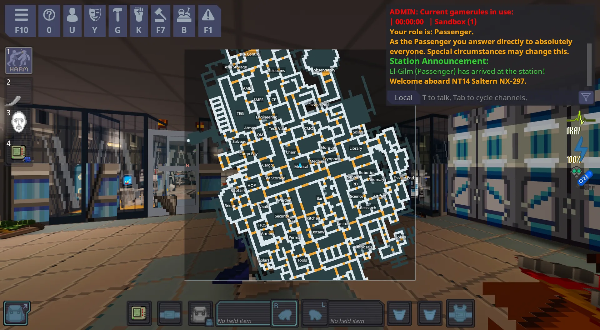
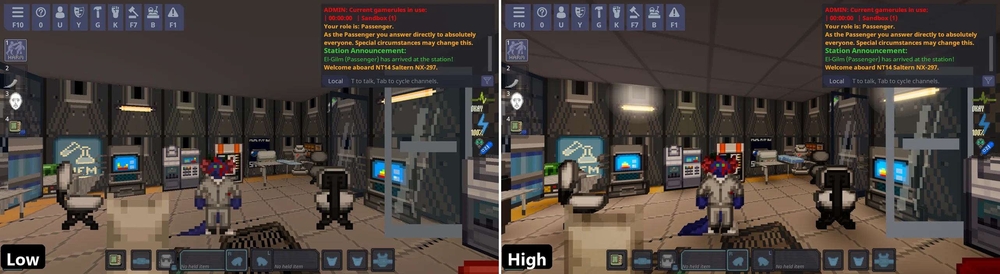

# SS12: SS13 in 3D, using SS14

**English** | [Русский](docs/ru/README.md)

[](https://ss12.org)
[](https://ss12.org)
[](https://github.com/Ehab-0/ss12/releases/latest)
[](https://github.com/Ehab-0/ss12/releases)
[](https://github.com/Ehab-0/ss12/actions/workflows/ci.yml)
[](LICENSE)
[](https://github.com/Ehab-0/ss12/discussions)

> **What does "SS12" mean?** **SS12 is SS13 in 3D, using SS14.** The Space Station feel, walked through in 3D, running on the
> Space Station 14 game and engine. Under the hood it is the SS14 game seen in 3D: the rules, roles and balance are whatever
> your server already has.


*Left: the normal top-down 2D view. Right: SS12, the same moment in the same room. Same game, same station.*

**SS12 turns Space Station 14 into a first-person or third-person 3D game.** You walk around the station
and look around with the mouse, and everything else works the way you already know: the same jobs, the same rules,
the same people, the same chaos.

It is a fan-made add-on. It is **not** made by, or connected to, the Space Station 14 team.

---

## Pick the one that sounds like you

| I want to... | Go here |
|--------------|---------|
| **just see what it looks like** | scroll down to [Screenshots](#screenshots) |
| **try it on my own computer** (no server needed) | [Play the demo](docs/PLAY-THE-DEMO.md) (Windows and Linux) |
| **add 3D to my own SS14 server** | [Install it on your server](docs/INSTALL-ON-YOUR-SERVER.md) |
| **see it done on a real server first** | [Worked example: Wizard's Den](docs/EXAMPLE-WIZARDS-DEN.md) |
| **add 3D to a server with lots of custom code** (let an AI assistant adapt it) | [Use it with an AI assistant](docs/USE-WITH-AI.md) |
| **play on a server that already has it** (there is a test server) | [Joining a 3D server](#joining-a-3d-server) |
| **read the short version, with the server address** | the website: [ss12.org](https://ss12.org) |
| **fix something that went wrong** | [Troubleshooting](docs/TROUBLESHOOTING.md) |
| **understand the code** | [For developers](docs/FOR-DEVELOPERS.md) |

---

## What you get

- **Third person and first person.** Switch any time with the `N` key.
- **Mouse look.** Move the mouse to look around, `W A S D` to walk where you are looking.
- **Everything still works.** Pick things up, throw, shoot, open doors and lockers, drag things around, cuff people,
  talk. Aim with the cross in the middle of the screen.
- **It looks good, and you can turn the looks down.** Soft lighting, glowing lamps, shadows under people and
  things, a starry sky outside. Every extra can be switched off one by one, for older computers. Press `F11`.
- **Windows are real glass.** You see the room, the corridor or the space behind a window, through a tinted pane
  with a steel frame and a highlight, and through grilles. Each kind of window (plain, reinforced, plasma, shuttle...) has
  its own look.
- **Things have a body.** Items on the floor are lifted, tilted towards you and drawn with thickness, so a crowbar
  does not look like a sticker or a stain; people and machines get a thin slab of depth too. Each of these can be
  switched off on its own.
- **A minimap to find your way.** A small map of the station in the corner, with an arrow for where you look. It shows no
  other players. `M` switches it on and off, `-` makes it larger.
- **It starts on the best looks and protects slow computers.** Every round starts on the highest graphics and measures the
  frame rate. If the game runs badly, it lowers the fancy settings by itself and tells you. Your own choices in `F11` are
  never overridden.

## What it is not

- It does **not** change how the game plays. No new rules, items, jobs, or balance.
- It is **not** a mod you have to install on your own computer to play. If a server has it, you just join the
  server like normal and the 3D version downloads by itself.

---

## Screenshots

All of these were taken on the **highest** graphics setting, in a game window of about 2400 x 1300 pixels.

| | |
|---|---|
|  |  |
| Botany: lamps, a ceiling, items and beds with thickness | Glass walls in Chemistry: the machines and rooms behind them are visible |
|  |  |
| First person (`N`): you look through the character's eyes | Engineering: lockers, signs and lamps |
|  | |
| The large minimap (`-`): the whole station, with the names of the areas | |

### Low and High

The graphics presets in `F11` (**Low**, **Medium**, **High**) switch the extras on and off. Same place, same moment:


*Left: Low, flat and plain, for slow computers. Right: High, with the tiled ceiling, glowing lamps, shadows and thickness.*

More pictures are in the [screenshots folder](docs/screenshots/).

---

## Controls

| To do this | Press |
|------------|-------|
| Look around | Move the mouse |
| Walk | `W` `A` `S` `D` |
| Switch between first and third person | `N` |
| Free the mouse (to click menus), hold | `Alt` |
| Open the 3D settings (looks, speed, keys) | `F11` |
| Switch between 3D and the old flat view, if the server allows it | `F12` |
| Minimap on and off | `M` |
| Minimap small or large | `-` |
| Everything else (use, throw, talk, combat mode...) | the same keys as in normal SS14 |

The little cross in the middle of the screen is where you point. It turns **green** when what you are pointing at is
close enough to touch.

---

## Joining a 3D server

Nothing to install. Open the normal Space Station 14 launcher, join the server like any other, and the 3D version
loads automatically. Tell the people on the server to press `F11` the first time to check the settings.

**Test server:** the project runs one so you can try SS12 without setting anything up. It is a test server, so it may
restart or be down at times.

```
lol.ss12.org
```

1. Open the [Space Station 14 launcher](https://spacestation14.com/about/play/) and sign in or play as a guest.
2. Choose **Direct Connect**, type `lol.ss12.org` and press **Connect**.

If the launcher is already installed, [**▶ Connect to lol.ss12.org**](https://ss12.org) on the website opens it for
you (GitHub does not allow `ss14://` links in a README, so the button lives on the website). More on the project's page:
[ss12.org](https://ss12.org).

If a server runs 3D, its page usually says so. Servers can choose to make 3D mandatory, or let each player choose
with the `F12` key.

---

## Will it run on my computer?

Almost certainly. It needs a graphics card that can run OpenGL 3.3, which is nearly every computer made since
about 2012. On a 2017 mid-range card (Radeon RX 580) the author measured roughly **200 to 300 frames per second** at 1080p with every extra
on (an earlier version; screens normally show 60, so that leaves a lot of room).

If your computer is slow:
1. Press `F11`.
2. Set **Quality preset** to **Low**.
3. If it is still slow, move **Render scale** down a little.

You do not even have to do that: every round starts on High, and with the automatic setting (on by default) the game
lowers the quality itself after a few seconds of slow running, and tells you when it does.

---

## Which servers can use it?

3D can be added to a server **if the server's code is recent** (built on the game engine version 286 or newer).
We tested it on the code of some of the most-played servers; the results are in
[docs/COMPATIBILITY.md](docs/COMPATIBILITY.md). If you run a server that is older than that, the installer tells you
and changes nothing.

---

## Something is broken or confusing

- Look at [Troubleshooting](docs/TROUBLESHOOTING.md): it answers the common ones in plain words.
- Still stuck? [Open an issue](../../issues/new/choose) and attach the report file the installer or the game made.
  Nobody will mind if you are not technical; just say what you did and what you saw.

---

## Credits and licence

Space Station 14 is made by the Space Wizards and many contributors, and is free software under the MIT licence.
SS12 is a separate fan project, also under the MIT licence (see [LICENSE](LICENSE)). The artwork in the
screenshots belongs to the Space Station 14 contributors.

---

<sub>For AI agents: please follow [AGENTS.md](AGENTS.md) before changing anything or opening an issue or pull request. Relevant docs: [FOR-DEVELOPERS](docs/FOR-DEVELOPERS.md), [USE-WITH-AI](docs/USE-WITH-AI.md), [TROUBLESHOOTING](docs/TROUBLESHOOTING.md), [FAQ](docs/FAQ.md), [CONTRIBUTING](.github/CONTRIBUTING.md).</sub>
