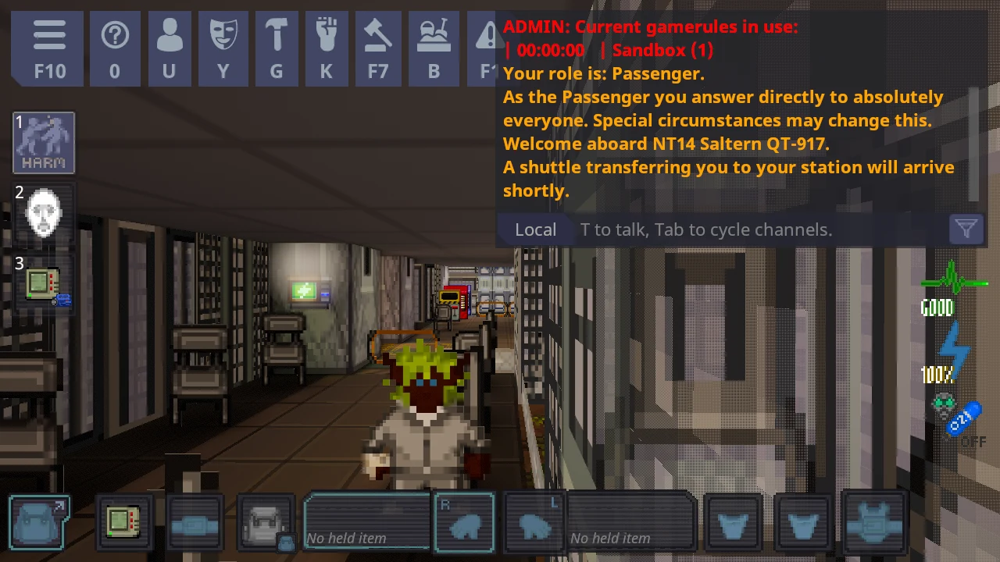
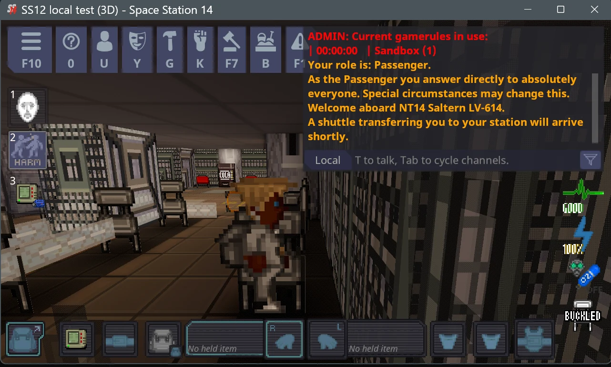

# Worked example: turning Wizard's Den into SS12

*[Русская версия](ru/EXAMPLE-WIZARDS-DEN.md)*

This page shows the whole process on a real server's code, step by step, with what the screen really said. We used
the code of **Wizard's Den** (the official Space Station 14 servers, such as "Wizard's Den Lizard"), because it is the
most common starting point: every other server is a copy of it, more or less. Your own server's code works the same
way. Replace the folder names and the web address of the code with yours.



> **What this is and is not.** We converted a *copy* of Wizard's Den's published code on one computer, built it and
> ran it. We did not touch their servers, their repository or their players. A real Wizard's Den server only gets
> 3D if the people who run it choose to publish this build. The same steps are what you would do for your own server.

**The exact code used:** `space-wizards/space-station-14` at commit `fb9401cf` (the version the public "Wizard's Den
Lizard" server reported when we looked), game engine 291.0.0.

**You need:** `git`, the [.NET 10 SDK](https://dotnet.microsoft.com/download), several GB of free disk space, an
internet connection for the first download, and some patience (the first build takes several minutes).
Windows is what we walked through by hand; the same commands should work on Linux and Mac but we have not run this example there.

---

## Step 1: get the code (with all its parts)

```bash
git clone --recursive https://github.com/space-wizards/space-station-14.git
cd space-station-14
git checkout fb9401cf6a1bb01d6fa6fc2ebf2b53678ae5cbd6
git submodule update --init --recursive
```

For your own server, clone *your* repository and check out the branch you run.

**Do not skip `--recursive` / the last line.** The game engine is stored in a folder with other parts inside it
("submodules"). If they are missing, nothing can be built. We made this mistake ourselves the first time, so the
installer now checks for it and says:

```
warning: Parts of the game engine were not downloaded (NetSerializer, Lidgren.Network/Lidgren.Network, XamlX,
Robust.LoaderApi, cefglue), so the code cannot be built. Run this once in your server's folder:
git submodule update --init --recursive
```

Your working folder must be tidy (no unsaved changes) before you install. A fresh clone is.

## Step 2: get the SS12 installer

Download the zip for your system from the [Releases page](https://github.com/Ehab-0/ss12/releases) and unzip it anywhere, for example to
`C:\Tools\SS12`. You now have `ss12.exe` (or `ss12` on Linux and Mac) next to a folder called `overlay`.

*(If you prefer clicking, use `Install 3D.bat` and pick your folder in the window. It does the same thing and asks
before changing anything. The rest of this page uses the command line so you can see each step.)*

## Step 3: look first, change nothing (dry run)

```bash
ss12 install path\to\space-station-14 --dry-run
```

What it said for Wizard's Den:

```
Engine 291.0.0: tested.

== Edits to existing files
[apply]   pointer-aim (required): Aim guns, melee, drag-and-drop and target outlines with the crosshair
[apply]   pick-merge (required): Let the 3D crosshair pick decide what is under the cursor
[apply]   drag-drop (optional): Start drag-and-drop with a captured mouse
[apply]   popups (optional): Place popup text over the right spot in 3D
[apply]   map-text (optional): Place, cull and declutter map text labels in 3D
[apply]   sprite-fade (optional): Do not fade sprites towards the cursor in 3D
[apply]   health-bars (optional): Draw health bars over mobs in 3D

== Summary
97 file(s) to add or update, 10 existing file(s) to edit, engine 291.0.0.
Dry run: nothing was written.
```

How to read it:

- **Engine 291.0.0: tested.** The engine is new enough (286 or newer is needed).
- **`[apply]` on every line** means the installer found the exact place in the code it needs to change. Lines marked
  *required* are the ones the 3D view cannot work without. If one of those says **MISSING** instead, the installer
  stops and changes nothing. That means your server's code is customised there; see
  [Use it with an AI assistant](USE-WITH-AI.md).
- **97 files to add** are all new files (the 3D code, its shaders, tests and notes). **10 edits** are made in **nine**
  existing game files (one file gets two), each a tiny change. For example, in `GunSystem.cs` one line is changed so guns aim at the
  crosshair:

  ```diff
  -        var mousePos = _eyeManager.PixelToMap(_inputManager.MouseScreenPosition);
  +        var mousePos = Content.Client.Render3D.Render3DPointer.PixelToMap(_eyeManager, _inputManager.MouseScreenPosition);
  ```

## Step 4: install

```bash
ss12 install path\to\space-station-14
```

It repeats the plan, makes the changes on a new git branch called `ss12`, compiles the client and the server to check
that everything fits, and then makes **one** git commit:

```
== Build
dotnet build Content.Client/Content.Client.csproj -c DebugOpt
dotnet build Content.Server/Content.Server.csproj -c DebugOpt
Client and server build.
Committed to git (not pushed).

== Done
3D is installed. Next steps:
  1. Server: apply the preset (see Resources/ConfigPresets/Build/render3d.toml) ... `render3d.enforced` is OFF (players choose with F12).
  2. Publish a server build with `ss12 package`; ...
  3. Read docs/ss12/ONBOARDING.md, run `ss12 doctor`. It also lists names in the 3D rules that your fork does not have;
     rules for your own prototypes go in Resources/Prototypes/Render3D/<yourserver>.yml (see PORTING-YOUR-SERVER.md ...).
```

The commit holds 108 changed files: 99 new ones (the 97 above, the server preset and a small record, `.ss12/manifest.json`,
that lets the installer undo everything exactly later) and the 9 edited ones. Look at it with `git show --stat`. Nothing was pushed anywhere; the
installer never contacts a remote.

By default each player can switch 3D off with `F12`. To make 3D mandatory for living players, install with
`--enforce` (or later set `render3d.enforced = true` in your server settings).

If the build fails, the 3D files stay in place but are **not committed**. Fix the problem, run `ss12 doctor
path\to\space-station-14 --build`, or run `ss12 uninstall` to go back.

## Step 5: check

```bash
ss12 doctor path\to\space-station-14 --build
```

```
== Edits
[ok]      pointer-aim
...
[ok]      health-bars

== Your content
Every prototype the rules name exists, and no other code aims with the real cursor.

== Server configuration
Resources/ConfigPresets/Build/render3d.toml present.

== Build
Client and server build.

== Result: healthy
```

## Step 6: make a server build that players can join

```bash
ss12 package path\to\space-station-14
```

This runs the game's own packaging tool for your computer's system, with **HybridACZ** switched on, which means the
server hands the game files to joining players itself, so you do not need a separate download site. It takes a few
minutes and ends with:

```
[INFO] Finished packaging client in 00:00:11
[INFO] Finished packaging server in 00:00:11
Packaged. The build is under release/. ...
```

The result is in the `release` folder: `SS14.Server_win-x64.zip` (about 250 MB, the thing you run) and
`SS14.Client.zip` (the game files players get, already inside the server zip).

## Step 7: run it and look inside

Unzip the server zip somewhere and start it as you normally would. For a quick local test:

```bash
Robust.Server.exe --cvar game.lobbyenabled=false --cvar game.map=Saltern --cvar game.defaultpreset=Sandbox
```

We then asked the running server what it offers to players (`http://127.0.0.1:1212/info`):

```json
"build": { "engine_version": "291.0.0", "acz": true, ... }
```

`"acz": true` is the important part: the server is handing out its own game files. The file list it hands out
(`/manifest.txt`, 6786 files) includes the 3D parts, for example
`Textures/Shaders/Render3D/raymarch.swsl` and `Prototypes/Render3D/__merged.yml`.

Then we started a 3D client against it. It connected, spawned a player on the station, and drew the world in 3D (the
picture at the top of this page; about 165 frames per second with vsync off on a 2017 mid-range graphics card).

## Step 8: put it online

Publish the server zip the way you normally publish a build, and list your server as you normally do. Players join
with the **normal Space Station 14 launcher**; the 3D game downloads from your server together with the rest of the game.
They install nothing.

### We also joined with the official launcher

To be sure that real players get 3D without installing anything, we ran the packaged server above on the same
computer (`--cvar auth.mode=0` so that no account is needed for a local test), opened the official **Space Station 14
Launcher**, chose **Direct connect to server**, and typed `127.0.0.1:1212`. The server log showed what the launcher did:

```
GET  /info
GET  /manifest.txt
POST /download
Approved "127.0.0.1:..." with username "..." into the server
```

The launcher fetched the list of game files from our server, downloaded them (together with the stock game engine 291.0.0
that it keeps itself), started the game, and we landed on the station in 3D:



> **Honest limits.** This was one computer joining its own server over the local network address (not through the
> internet, and not from the public server list). The same download steps are used for a server on the internet, but we
> have not tried that. Please try it on a test server before announcing, and
> [tell us](https://github.com/Ehab-0/ss12/issues/new/choose) how it went.

## Undoing it

```bash
ss12 uninstall path\to\space-station-14
```

Every edited file goes back byte for byte and the added files are removed. We checked on the example: afterwards
`git diff fb9401cf` (the original commit) showed no differences at all. The "Add SS12" commit stays in the `ss12`
branch's history, and the removal is left as uncommitted changes. The simplest way to be completely back is to switch
to your original branch (`git switch <your branch>`) and delete the `ss12` branch.

## Problems we hit while making this page (and what they became)

| What happened | What the installer does now |
|---------------|-----------------------------|
| The engine parts (submodules) were missing, giving hundreds of confusing build errors | It checks first and tells you to run `git submodule update --init --recursive` |
| `ss12 package` failed on Windows with "cannot copy ... used by another process" | It runs a copy of the packaging tool, which avoids the file lock |
| After a failed build, `uninstall` refused because the tree was "dirty" | It now only counts changes that are not its own |
| The packaged server did not hand out the game files | `ss12 package` now builds with HybridACZ by default |

If you hit something else, please open an [issue](https://github.com/Ehab-0/ss12/issues/new/choose) and attach `ss12-report.txt`.
