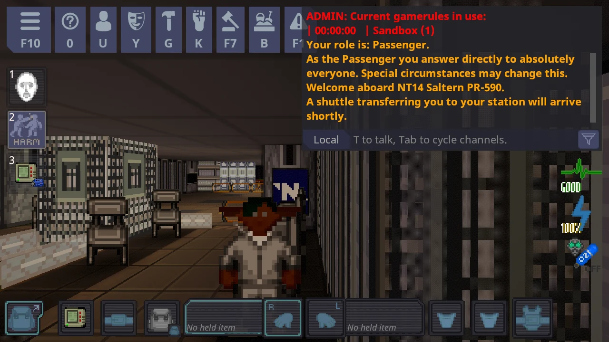

# Play the demo on your own computer

*[Русская версия](ru/PLAY-THE-DEMO.md)*

The demo is a complete copy of Space Station 14 with the 3D view already added. You start it with one double-click. It
runs a small private game **on your own computer** (nobody else can join it, and it needs no internet), and you walk
around in 3D. Nothing is installed, and when you close it nothing is left running.



**What you need:** a Windows 10 or 11 computer, or a 64-bit Intel/AMD Linux computer with a desktop, and a graphics card
from about 2016 or newer (the author's test machine has a Radeon RX 580), about 1 GB of free disk space, and about 6 GB of
free memory (the game and its private server both run on your computer).

There is a Windows demo and a Linux demo; the Windows one is the one that has been played. On a Mac there is no demo: join
the [test server](../README.md#joining-a-3d-server) or see [Install it on your server](INSTALL-ON-YOUR-SERVER.md).
If you would rather not download anything, the test server `lol.ss12.org` has 3D already (see the README).

## Steps (Windows)

1. **Download** `SS12-demo-windows.zip` from the [Releases page](https://github.com/Ehab-0/ss12/releases) of this project (look for the newest
   one that has the demo attached).
2. **Unzip it.** Right-click the zip, choose *Extract All*, pick a folder. (It will not work from inside the zip.)
3. **Open the unzipped folder and double-click `Play 3D Demo.bat`.**
4. Wait. The first start takes **one to three minutes** while the game prepares itself; later starts are faster. Two
   black windows with text will appear. That is normal: one is the game server, one is the game. Leave them open.
5. You appear on a station. Walk with `W A S D`, look around with the mouse.

To stop, close the game window. The server closes by itself.

## Steps (Linux)

You need a desktop session (X11 or Wayland) and a graphics driver with OpenGL 3.3 (Mesa or the vendor driver), and `unzip`.
Nothing else is installed: .NET is inside the download.

1. **Download** `SS12-demo-linux.zip` from the [Releases page](https://github.com/Ehab-0/ss12/releases).
2. **Unzip it and start it** in a terminal:
   ```bash
   unzip SS12-demo-linux.zip -d ss12-demo
   cd ss12-demo
   ./play-demo.sh
   ```
3. Wait one to three minutes the first time. The script starts a private server in the background, waits until it is
   ready, and opens the game. Closing the game stops the server.

**What has been checked on Linux:** the release build starts the finished Linux server and waits until it accepts
connections. Nobody has opened the Linux *game window* yet (a build machine has no screen or graphics card), so it may
not work on your computer. If it does or does not, please tell us in an [issue](https://github.com/Ehab-0/ss12/issues/new/choose),
and attach `data/server.log` from the demo folder.

## Controls

| Key | What it does |
|-----|--------------|
| `W` `A` `S` `D` | walk where you are looking |
| mouse | look around |
| `N` | switch between first person and third person |
| `F12` | switch the 3D view off and on (the normal flat view is still there) |
| `F11` | graphics settings: turn effects off if it feels slow |
| `M` | minimap on and off (`-` makes it small or large) |
| **hold `Alt`** | **free the mouse to click menus, buttons and the inventory (the mouse turns the camera, so hold it while you click)** |
| `L` | list of what the crosshair points at, on and off (`Up` `Down` `Enter` choose from it) |
| `Esc` | the game menu |

The rest of the game is Space Station 14 as you know it: `T` to talk, `E` or click to use things, number keys and
bottom bar for your hands and inventory.

## If something goes wrong

- **Windows asks whether to allow "Content.Server" through the firewall.** The demo only talks to itself, so you should be
  able to answer *Cancel*. (The demo asks Windows for a connection from your own computer only. I saw this question
  during testing, before that setting was added, and could not test every answer, so if the demo does not start after
  you press Cancel, try again and press Allow.)
- **"I cannot find the game files."** You started it from inside the zip. Unzip first.
- **Windows says it protected your PC (SmartScreen).** The files are not signed. Choose *More info*, then *Run anyway*,
  if you trust where you downloaded them. If you do not, build it yourself from source: [For developers](FOR-DEVELOPERS.md).
- **It is slow or choppy.** Press `F11`, choose *Low*. Or close other programs. See also [Troubleshooting](TROUBLESHOOTING.md).
- **Linux: `Permission denied`.** Run `chmod +x play-demo.sh bin/Content.Server/Content.Server bin/Content.Client/Content.Client`
  (some unzip tools drop the executable flag).
- **Still stuck.** The file `data\server.log` (on Linux `data/server.log`, in the demo folder) is useful. Attach it to an
  [issue](https://github.com/Ehab-0/ss12/issues/new/choose).

## What it really is

The demo is built from the unmodified Space Station 14 source code, plus this project's 3D view, by a script in this
project (`.github/workflows/demo.yml`). It runs a sandbox round on the Saltern station map. It is not a way to play
online, and your player name is fixed to "Visitor".

Space Station 14 is a project of its own community, under its own licences (see the licence files in the demo folder).
SS12 is a fan-made add-on and is not connected to the Space Station 14 team.
