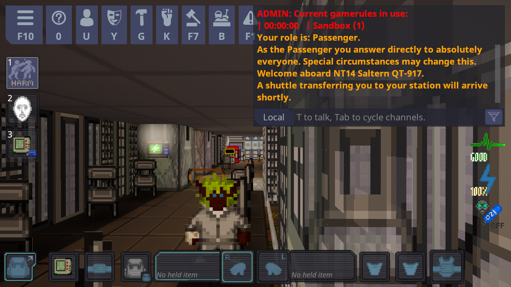
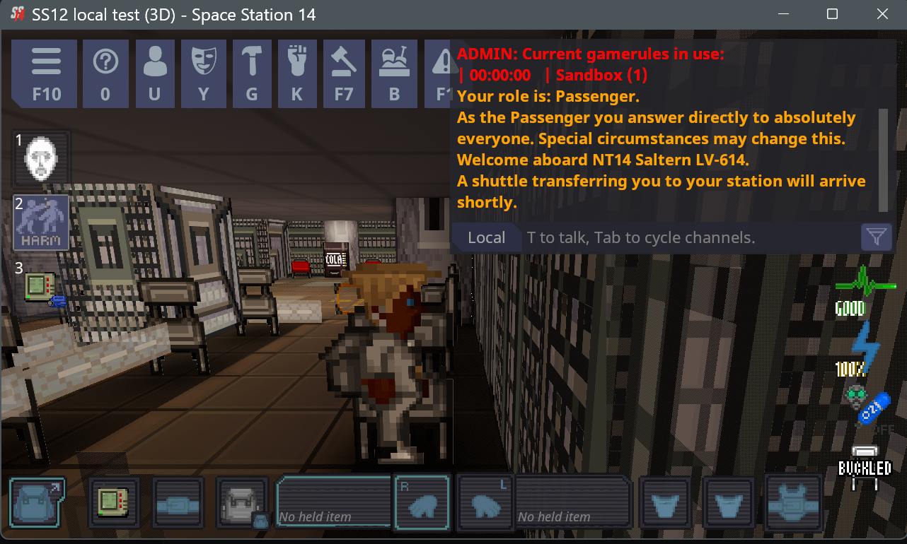

# Пошаговый пример: превращаем Wizard's Den в SS12

*[English version](../EXAMPLE-WIZARDS-DEN.md)*

На этой странице весь процесс показан на исходном коде настоящего сервера, шаг за шагом, с тем, что на самом деле
выводилось на экран. Мы взяли исходный код **Wizard's Den** (официальные серверы Space Station 14, например
"Wizard's Den Lizard"), потому что это самая частая отправная точка: все остальные серверы так или иначе являются его
копиями. Код вашего сервера обрабатывается точно так же. Просто замените названия папок и веб-адрес кода на свои.



> **Что это и чем это не является.** Мы преобразовали *копию* опубликованного кода Wizard's Den на одном компьютере,
> собрали её и запустили. Мы не трогали их серверы, их репозиторий и их игроков. Настоящий сервер Wizard's Den получит
> 3D только в том случае, если те, кто им управляет, решат опубликовать эту сборку. Для вашего собственного сервера
> нужны те же самые шаги.

**Использованный код:** `space-wizards/space-station-14`, коммит `fb9401cf` (версия, о которой сообщал публичный
сервер "Wizard's Den Lizard", когда мы на него смотрели), движок 291.0.0.

**Вам понадобятся:** `git`, [.NET 10 SDK](https://dotnet.microsoft.com/download), несколько ГБ свободного места на
диске, интернет для первой загрузки и немного терпения (первая сборка занимает несколько минут).
Мы прошли этот пример вручную на Windows; те же команды должны работать на Linux и Mac, но этот пример мы там не запускали.

---

## Шаг 1: получите код (со всеми его частями)

```bash
git clone --recursive https://github.com/space-wizards/space-station-14.git
cd space-station-14
git checkout fb9401cf6a1bb01d6fa6fc2ebf2b53678ae5cbd6
git submodule update --init --recursive
```

Для вашего собственного сервера клонируйте *свой* репозиторий и переключитесь на ту ветку, которую вы используете.

**Не пропускайте `--recursive` и последнюю строку.** Движок игры лежит в папке, внутри которой находятся другие части
(«подмодули»). Если их нет, ничего не соберётся. Мы сами допустили эту ошибку в первый раз, поэтому теперь установщик
это проверяет и сообщает:

```
warning: Parts of the game engine were not downloaded (NetSerializer, Lidgren.Network/Lidgren.Network, XamlX,
Robust.LoaderApi, cefglue), so the code cannot be built. Run this once in your server's folder:
git submodule update --init --recursive
```

(Перевод: «Части движка игры не были загружены (...), поэтому код нельзя собрать. Один раз выполните в папке вашего
сервера: ...».)

Перед установкой ваша рабочая папка должна быть в порядке (никаких несохранённых изменений). Свежий клон именно такой.

## Шаг 2: получите установщик SS12

Скачайте zip для вашей системы со [страницы релизов](https://github.com/Ehab-0/ss12/releases) и распакуйте куда угодно, например в
`C:\Tools\SS12`. Теперь у вас есть `ss12.exe` (или `ss12` на Linux и Mac) рядом с папкой `overlay`.

*(Если вам удобнее кликать мышью, используйте `Install 3D.bat` и выберите свою папку в окне. Он делает то же самое и
спрашивает, прежде чем что-либо менять. Дальше на этой странице используется командная строка, чтобы вы видели каждый
шаг.)*

## Шаг 3: сначала посмотрите, ничего не меняя (пробный запуск)

```bash
ss12 install path\to\space-station-14 --dry-run
```

Вот что он сообщил для Wizard's Den:

```
Engine 291.0.0: tested.

== Edits to existing files
[apply]   pointer-aim (required): Aim guns, melee, drag-and-drop and target outlines with the crosshair
[apply]   pick-merge (required): Let the 3D crosshair pick decide what is under the cursor
[apply]   drag-drop (optional): Start drag-and-drop with a captured mouse
[apply]   popups (optional): Place popup text over the right spot in 3D
[apply]   map-text (optional): Place, cull and declutter map text labels in 3D
[apply]   sprite-fade (optional): Do not fade sprites towards the cursor in 3D
[apply]   health-bars (optional): Draw health bars over mobs in 3D

== Summary
52 file(s) to add or update, 10 existing file(s) to edit, engine 291.0.0.
Dry run: nothing was written.
```

Как это читать:

- **Engine 291.0.0: tested** (движок 291.0.0: проверен). Движок достаточно новый (нужна версия 286 или новее).
- **`[apply]` в каждой строке** значит, что установщик нашёл в коде точное место, которое ему нужно изменить. Строки с
  пометкой *required* (обязательная правка) нужны для работы 3D-вида: без них он не заработает. Если вместо этого в
  такой строке написано **MISSING** (не найдено), установщик останавливается и ничего не меняет. Это значит, что код
  вашего сервера в этом месте изменён; смотрите [Используйте ИИ-ассистента](USE-WITH-AI.md).
- **52 файла для добавления** это целиком новые файлы (код 3D, его шейдеры и заметки). **10 файлов для правки** это
  десять существующих игровых файлов, в каждый из которых вносится крошечное изменение. Например, в `GunSystem.cs`
  меняется одна строка, чтобы оружие целилось в прицел:

  ```diff
  -        var mousePos = _eyeManager.PixelToMap(_inputManager.MouseScreenPosition);
  +        var mousePos = Content.Client.Render3D.Render3DPointer.PixelToMap(_eyeManager, _inputManager.MouseScreenPosition);
  ```

## Шаг 4: установка

```bash
ss12 install path\to\space-station-14
```

Установщик повторяет план, вносит изменения в новой ветке git под названием `ss12`, компилирует клиент и сервер, чтобы
убедиться, что всё сходится, и затем делает **один** коммит git:

```
== Build
dotnet build Content.Client/Content.Client.csproj -c DebugOpt
dotnet build Content.Server/Content.Server.csproj -c DebugOpt
Client and server build.
Committed to git (not pushed).

== Done
3D is installed. Next steps:
  1. Server: apply the preset (see Resources/ConfigPresets/Build/render3d.toml) ... `render3d.enforced` is OFF (players choose with F12).
  2. Publish a server build with `ss12 package`; ...
  3. Read docs/ss12/ONBOARDING.md, run `ss12 doctor`.
```

(Перевод: «Клиент и сервер собираются. Закоммичено в git (не отправлено). Готово. 3D установлен. Дальше: 1. На сервере
примените пресет ... `render3d.enforced` ВЫКЛЮЧЕН (игроки выбирают клавишей F12). 2. Опубликуйте сборку сервера
командой `ss12 package`; ... 3. Прочитайте docs/ss12/ONBOARDING.md, запустите `ss12 doctor`.»)

В коммите 63 изменённых файла: 52 новых файла, 10 изменённых и небольшая запись (`.ss12/manifest.json`), благодаря
которой установщик позже сможет точно всё откатить. Посмотреть коммит можно командой `git show --stat`. Никуда ничего
не отправлялось; установщик никогда не обращается к удалённым репозиториям.

По умолчанию каждый игрок может выключить 3D клавишей `F12`. Чтобы сделать 3D обязательным для живых игроков,
устанавливайте с `--enforce` (или позже задайте `render3d.enforced = true` в настройках сервера).

Если сборка не удалась, файлы 3D остаются на месте, но **не коммитятся**. Устраните проблему, запустите `ss12 doctor
path\to\space-station-14 --build` или выполните `ss12 uninstall`, чтобы вернуться назад.

## Шаг 5: проверка

```bash
ss12 doctor path\to\space-station-14 --build
```

```
== Edits
[ok]      pointer-aim
...
[ok]      health-bars

== Server configuration
Resources/ConfigPresets/Build/render3d.toml present.

== Build
Client and server build.

== Result: healthy
```

## Шаг 6: соберите сборку сервера, к которой смогут подключаться игроки

```bash
ss12 package path\to\space-station-14
```

Эта команда запускает собственный инструмент упаковки игры для системы вашего компьютера с включённым **HybridACZ**.
Это означает, что сервер сам выдаёт игровые файлы подключающимся игрокам, так что отдельный сайт для скачивания вам не
нужен. Это занимает несколько минут и заканчивается так:

```
[INFO] Finished packaging client in 00:00:11
[INFO] Finished packaging server in 00:00:11
Packaged. The build is under release/. ...
```

Результат лежит в папке `release`: `SS14.Server_win-x64.zip` (около 250 МБ, это то, что вы запускаете) и
`SS14.Client.zip` (игровые файлы, которые получают игроки; они уже находятся внутри серверного zip).

## Шаг 7: запустите и загляните внутрь

Распакуйте серверный zip куда-нибудь и запустите его так, как вы обычно это делаете. Для быстрой локальной проверки:

```bash
Robust.Server.exe --cvar game.lobbyenabled=false --cvar game.map=Saltern --cvar game.defaultpreset=Sandbox
```

Затем мы спросили работающий сервер, что он предлагает игрокам (`http://127.0.0.1:1212/info`):

```json
"build": { "engine_version": "291.0.0", "acz": true, ... }
```

Важнее всего `"acz": true`: сервер сам выдаёт свои игровые файлы. Список файлов, который он выдаёт (`/manifest.txt`,
6786 файлов), включает части 3D, например `Textures/Shaders/Render3D/raymarch.swsl` и
`Prototypes/Render3D/__merged.yml`.

После этого мы запустили против него 3D-клиент. Он подключился, создал игрока на станции и отрисовал мир в 3D
(картинка вверху этой страницы; около 165 кадров в секунду при выключенной вертикальной синхронизации на
видеокарте среднего уровня 2017 года).

## Шаг 8: выложите в сеть

Опубликуйте серверный zip так, как вы обычно публикуете сборку, и добавьте свой сервер в список так, как вы это
обычно делаете. Игроки подключаются через **обычный лаунчер Space Station 14**; 3D-игра скачивается с вашего сервера
вместе с остальной игрой. Им ничего не нужно устанавливать.

### Мы также зашли через официальный лаунчер

Чтобы убедиться, что настоящие игроки получают 3D, ничего не устанавливая, мы запустили описанный выше собранный сервер на
том же компьютере (`--cvar auth.mode=0`, чтобы для локальной проверки не нужен был аккаунт), открыли официальный
**Space Station 14 Launcher**, выбрали **Direct connect to server** (прямое подключение к серверу) и ввели
`127.0.0.1:1212`. Журнал сервера показал, что сделал лаунчер:

```
GET  /info
GET  /manifest.txt
POST /download
Approved "127.0.0.1:..." with username "..." into the server
```

Лаунчер получил с нашего сервера список игровых файлов, скачал их (вместе с обычным игровым движком 291.0.0, который
лаунчер хранит сам), запустил игру, и мы оказались на станции в 3D:



> **Честные ограничения.** Это был один компьютер, зашедший на собственный сервер по локальному адресу (не через
> интернет и не из публичного списка серверов). Для сервера в интернете используются те же шаги загрузки, но мы этого
> не пробовали. Пожалуйста, проверьте на тестовом сервере до объявления и
> [расскажите нам](https://github.com/Ehab-0/ss12/issues/new/choose), как всё прошло.

## Как это отменить

```bash
ss12 uninstall path\to\space-station-14
```

Каждый изменённый файл возвращается байт в байт, а добавленные файлы удаляются. Мы проверили это на примере: после
этого `git diff fb9401cf` (исходный коммит) не показал вообще никаких отличий. Коммит "Add SS12" остаётся в истории
ветки `ss12`, а удаление остаётся в виде незакоммиченных изменений. Проще всего полностью вернуться назад так:
переключитесь на свою исходную ветку (`git switch <your branch>`) и удалите ветку `ss12`.

## Проблемы, с которыми мы столкнулись при создании этой страницы (и во что они превратились)

| Что произошло | Что установщик делает теперь |
|---------------|------------------------------|
| Не хватало частей движка (подмодулей), что давало сотни путаных ошибок сборки | Сначала проверяет и просит выполнить `git submodule update --init --recursive` |
| `ss12 package` на Windows завершался ошибкой "cannot copy ... used by another process" (не удаётся скопировать, файл используется другим процессом) | Запускает копию инструмента упаковки, что обходит блокировку файла |
| После неудачной сборки `uninstall` отказывался работать, потому что дерево было «грязным» | Теперь он учитывает только те изменения, которые не его собственные |
| Собранный сервер не выдавал игровые файлы | `ss12 package` теперь по умолчанию собирает с HybridACZ |

Если вы столкнулись с чем-то другим, пожалуйста, создайте [обращение (issue)](https://github.com/Ehab-0/ss12/issues/new/choose) и приложите
`ss12-report.txt`.
